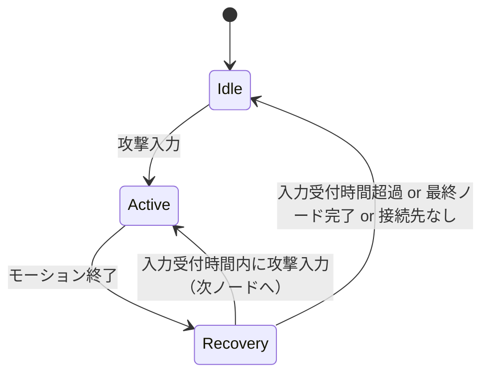

# コンボシステム

## 概要
コンボは「技」ではなく「ノード」の連鎖として構成する
各ノードには開始位置と終了位置があり、終了位置から接続可能な開始位置を持つノードへのみ遷移できる
プレイヤーはこの制約の中でコンボルートを自由に構成する

---

## ノード構造

### ノードの定義
各ノードは以下の情報を持つ

| フィールド | 説明 |
|-----------|------|
| ノードID | 一意の識別子 |
| 武器種別 | どの武器で使用可能か |
| 開始位置 | このノードが始まる武器の構え位置 |
| 終了位置 | このノードが終わった後の武器の位置 |
| フォロースルー | 終了後に武器を体の後ろに回し、対角から次のコンボに繋ぐ |
| ダメージ倍率 | 武器基礎ダメージに掛ける倍率 |
| モーション時間 | アニメーション再生時間 |
| 硬直時間 | ノード後の入力不可時間 |
| 入力受付時間 | 次のノードへの遷移入力を受け付ける時間窓 |
| 解放条件 | レベルや条件で解放される |

---

## 位置（NodePosition）

### 10方向

8方向＋前＋手前の計10方向

```
    左上    上    右上
      ＼   ｜   ／
  左 ── ・ ── 右
      ／   ｜   ＼
    左下    下    右下

  前（突き方向）  手前（引き戻し方向）
```

| 位置 | 説明 |
|------|------|
| 上 (Upper) | 頭上・上段構え |
| 右上 (UpperRight) | 右斜め上 |
| 右 (Right) | 右横 |
| 右下 (LowerRight) | 右斜め下 |
| 下 (Lower) | 足元・下段 |
| 左下 (LowerLeft) | 左斜め下 |
| 左 (Left) | 左横 |
| 左上 (UpperLeft) | 左斜め上 |
| 前 (Front) | 突き方向（槍等） |
| 手前 (Back) | 引き戻し方向（ニュートラル） |

---

## 接続ルール

### 8方向の接続
8方向は円形に配置され、終了位置から**隣接する3方向**（自身＋左右1つ）の開始位置のみに接続可能

```
    左上 ─── 上 ─── 右上
    │                   │
    左                 右
    │                   │
    左下 ─── 下 ─── 右下
```

| 終了位置 | 接続可能な開始位置 |
|---------|-------------------|
| 上 | 左上、上、右上 |
| 右上 | 上、右上、右 |
| 右 | 右上、右、右下 |
| 右下 | 右、右下、下 |
| 下 | 右下、下、左下 |
| 左下 | 下、左下、左 |
| 左 | 左下、左、左上 |
| 左上 | 左、左上、上 |

### 前・手前の接続
| 終了位置 | 接続可能な開始位置 |
|---------|-------------------|
| 前 | 前のみ |
| 手前 | **全方向**（ニュートラルなのでどこからでも始動可能） |

### 同じ武器種別のノード同士でのみ接続可能

---

## フォロースルー（FollowThrough）

### 概要
ノードに「フォロースルー」フラグがある場合、振り終わった武器を体の後ろに回して対角側から次のコンボに繋ぐ

### 効果
終了位置を**中心対角**に反転させて接続判定を行う

| 通常の終了位置 | フォロースルー後の実効位置 |
|--------------|----------------|
| 上 | 下 |
| 右上 | 左下 |
| 右 | 左 |
| 右下 | 左上 |
| 下 | 上 |
| 左下 | 右上 |
| 左 | 右 |
| 左上 | 右下 |
| 前 | 手前 |
| 手前 | 前 |（←手前からはどこへでも接続可能なので，フォロースルーなんて定義しなくていい）

### 例

```
[横薙ぎ: 左→右]
  通常: 次は 右上/右/右下 から始動
  フォロースルー: 武器を体の後ろに回す → 実効位置=左 → 次は 左下/左/左上 から始動

[突き: 手前→前]
  通常: 次は 前 から始動
  フォロースルー: 引き戻しの反動 → 実効位置=手前 → 次は全方向から始動可能
```

### 挙動
- 入力受付中に次の攻撃入力があった場合、次ノードの Active に入る前に「回し」アニメーションが挿入される
- 回しの間は攻撃判定なし・移動不可
- 回し完了後に次ノードの Active が始まる

### トレードオフ
- メリット: 接続先が対角に広がり、コンボの自由度が上がる
- デメリット: 回しアニメーション分だけ入力から攻撃発生までにラグが生じる

---

## グラフ構造

### コンボ設定
- メニュー画面で所有しているコンボノードを制約のもとで繋ぐ

### コンボ開始
- 待機状態からは任意の開始位置のノードを選択可能
- 待機状態は位置制約を受けない（どの位置からでも開始できる）
- 入力受付時間内に次の入力があるたびに設定されたコンボを順に実行していく

### コンボ終了
- 最大コンボ数は武器種別ごとに異なる（最大5）
- 最終ノードにはダメージ補正が乗る（軽いコンボでキャンセルして連発が一強になるのを防ぐため）
- 入力受付時間内に次の入力がなければコンボ終了
- 硬直時間経過後に待機状態へ戻る

### 武器別コンボ上限

| 武器 | 最大コンボ数 | 備考 |
|------|-------------|------|
| 大剣 | 3 | 少ない手数で高火力。最終段に到達しやすい |
| 短剣 | 5 | 手数型。最終段補正で帳尻を合わせる |
| 槌 | 3 | 大剣同様の重量型 |
| 棍 | 5 | 手数型 |
| 槍 | 4 | 中間 |
| 銃 | 1 | コンボなし（単発） |

---

## ノード解放

### 仕組み
- 初期状態では武器ごとに基本ノードのみ使用可能
- レベルアップや特定条件の達成でノードが解放される
- 解放されたノードはグラフに追加され、新たなコンボルートが開通する

### 解放の影響
- 新ノード解放により既存ノード間に新しい経路が生まれる
- プレイヤーの成長に応じてコンボの選択肢が広がる

---

## コンボ設定 UI

### ノード接続の視覚化
- 各ノードは位置情報を色分けで表示する
  - 開始位置：右，終了位置：左とかノードなら，ノードの左半分を「右」の色，ノードの右半分を「左」の色（コンボは左のノードから右のノードに繋げていくという想定）
- 接続可能なノードのみハイライト表示し、繋げないノードはグレーアウト
- フォロースルーフラグ付きのノードは特別なアイコンや色で識別可能にする

---

## 入力設計（仮）

### 基本
- メニュー画面でコンボを設定
- 攻撃ボタン1つで設定されたコンボを進行

---

## 状態遷移



| 状態 | 説明 |
|------|------|
| Idle | 待機。位置制約なし。どのノードからでも開始可能 |
| Active | ノードのモーション再生中。攻撃判定あり |
| Recovery | 硬直中＋次ノードへの入力受付窓。最終ノード（武器別上限）到達時は入力受付なし。フォロースルーありの場合は回しアニメーション再生中 |

---
