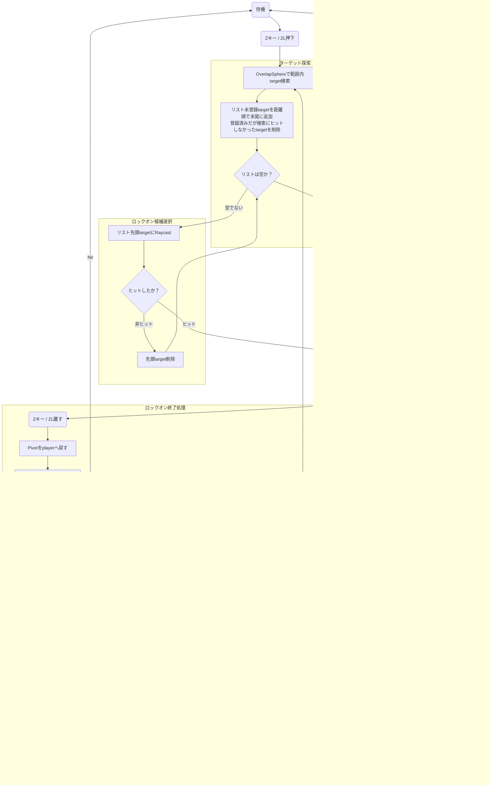

# ターゲットロックオン（Enemyタグオブジェクトが近くにある状態でZキー / ZL押下）

## 入力
- Zキー / ZLボタン（押し続けている間）

```mermaid
flowchart TD

    %% ===== 待機 =====

    A(待機)
    B(Zキー / ZL押下)
    A --> B

    %% ===== ターゲット探索 =====
    subgraph S0[ターゲット探索]
        direction TB
        C[OverlapSphereで範囲内target検索]
        D[リスト未登録targetを距離順で末尾に追加<br>登録済みだが検索にヒットしなかったtargetを削除]
        E{リストは空か？}
        F[カメラリセット]
        C --> D --> E
    end

    %% ===== 非ロックオン状態 =====
    subgraph S1[非ロックオン状態]
        direction TB
        F1{Z押下中？}
        F2[player向き固定・平行移動<br>カメラ自由]
        F --> F1
        F1 -- Yes --> F2 --> F1
    end

    %% ===== ロックオン候補探索 =====
    subgraph S2[ロックオン候補選択]
        direction TB
        G[リスト先頭targetにRaycast]
        H{ヒットしたか？}
        I[先頭target削除]
        G --> H
        H -- 非ヒット --> I --> E
    end

    %% ===== ロックオン状態 =====
    subgraph S3[ロックオン状態]
        direction TB
        J1{Z押下中？}
        J2[カメラPivotを中点へ]
        J3[playerをtarget方向へ向ける]
        J4[距離に応じてカメラ調整]

        J1 -- Yes --> J2 --> J3 --> J4
    end

    %% ===== 距離チェック =====
    subgraph S4[距離チェック]
        direction TB
        K{距離が閾値以上？}
        L[Pivotをplayerへ戻す]
        M[カメラ距離を通常に戻す]

        K -- Yes --> L --> M
    end

    %% ===== ロックオン終了 =====
    subgraph S5[ロックオン終了処理]
        direction TB
        N(Zキー / ZL離す)
        O[Pivotをplayerへ戻す]
        P[カメラ距離を通常に戻す]
        Q{猶予時間開始に再入力されたか？}
        R[先頭target削除（次候補へ）]

        N --> O --> P --> Q
        Q -- Yes --> R
    end

    %% ===== 接続（元の流れ維持） =====
    B --> C

    E -- 空 --> F
    F1 -- No --> A

    E -- 空でない --> G
    H -- ヒット --> J1

    J4 --> K
    K -- No --> J1
    M --> F1

    J1 -- No --> N
    Q -- No --> A
    R --> C
```

---
